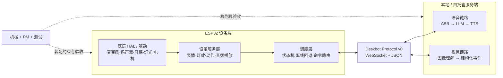

# 系统架构

## 原则

- 固件只通过稳定接口使用硬件，不让业务层依赖寄存器和具体引脚。
- 服务端语音与视觉相互独立，任一模块失败不应阻止设备基础动作。
- 协议由固件端和服务端共同维护；未知消息必须可安全忽略或明确报错。
- MVP 优先本地闭环，云端能力作为可替换适配器接入。

## 逻辑视图

## 模块边界

| 模块 | 负责 | 不负责 |
| --- | --- | --- |
| `firmware/hal` | 外设初始化、读写和板级适配 | 表情、动作和对话策略 |
| `firmware/services` | 将底层能力组合成表情、灯效、动作和播放服务 | 网络策略和 AI 推理 |
| `firmware/orchestrator` | 状态机、命令路由、断网回退 | 直接访问硬件寄存器 |
| `server/voice` | ASR、LLM、TTS 与流式会话 | 图像理解和板级控制 |
| `server/vision` | 图像输入与结构化视觉结果 | 直接驱动设备 |
| `protocol` | 消息版本、schema、示例与兼容规则 | 模块内部实现 |
| `mechanical` | 结构、装配、散热、线束、BOM | 固件和模型实现 |

## MVP 数据流

1. 设备发送 `session.hello`，声明协议版本与能力。
2. 服务端返回连接状态，并可发送 `device.command`。
3. 设备校验命令、调用服务层，然后发送 `device.event` 回报结果。
4. 语音链路成熟后，以同一会话关联音频流；视觉模块只输出结构化事件，不直接控制电机。

## 关键决策

- 第一阶段只承诺 WebSocket 控制消息；UDP/Opus 音频流在链路验证后增加。
- ESP32 无服务器时仍需能启动、显示待机表情并响应本地测试命令。
- 角色人格、记忆和模型供应商不进入设备协议，防止固件与某个 AI 服务绑定。
