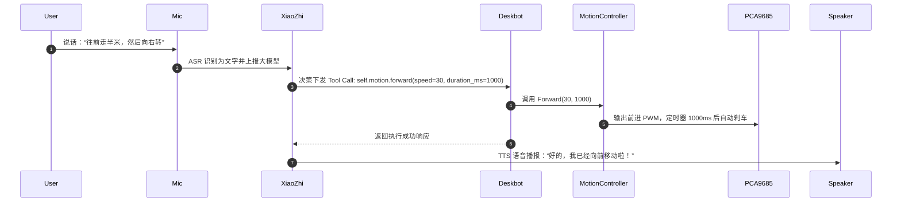

# Deskbot 调试记忆与接手文档 (Debugging Memory & Handover Guide)

本文档记录了 Deskbot 在立创实战派 ESP32-S3 开发板上的**完整调试历程**、**深层硬件/软件踩坑记忆**，以及面向下一位开发者的**系统接手与高阶智能体（Conversational & Vision Agent）开发指南**。

---

## 第一部分：关键调试记忆与踩坑复盘 (Debugging Memory)

在项目研发过程中，曾遭遇供电灰屏闪烁、多核 Panic 崩溃、摄像头彩色条纹花屏、舵机微漂等一系列典型嵌入式软硬件问题。以下记录其根本原因与解决机制。

### 1. 供电与电池灰屏闪烁排查复盘 (Battery Brownout Issue)

#### 现象描述
- 板卡直接通过 USB 连接电脑或高功率充电头时，系统启动完全正常，屏幕、摄像头、IMU、舵机均能稳定运行。
- 当拔下电脑 USB，改用小容量锂电池或常规移动电源的 5V 升压输出端供电时，屏幕反复出现**灰屏、闪烁并不断循环重启**，无法进入主系统。

#### 根本机理深度剖析
1. **瞬间浪涌电流叠加 (Inrush Current Spike)**：
   - ESP32-S3 在上电启动的瞬间，若同时开启：
     - Wi-Fi 射频校准与发射（瞬时峰值可达 350mA~500mA）
     - ST7789 屏幕背光 LED 开启
     - GC2145 摄像头 20MHz 外部时钟 (XCLK) 与内部感光矩阵初始化
     - ES8311 音频功放上电
     - PCA9685 PWM 输出使能
   - 瞬时电流突增超过 800mA~1A。
2. **电池升压模块压降导致硬件 Brownout**：
   - 电池升压模块（Boost Converter）在瞬态大电流响应瞬间，输出电压会出现几毫秒的跌落（Sag）。
   - ESP32-S3 内部的硬件低压检测器（Brownout Detector，默认阈值约 2.8V）检测到核心电压跌落，立即强制拉低复位引脚进行保护重启。
   - 重启后再次启动外设，电压再次跌落，从而陷入无休止的“开机 - 跌落 - 重启 - 灰屏闪烁”死循环。

#### 固件层已采取的应对优化
- **禁用 Brownout 检测器**：在 `LichuangDevBoard::Initialize()` 第一步调用 `WRITE_PERI_REG(RTC_CNTL_BROWN_OUT_REG, 0)`，防止毫秒级轻微压降触发死锁重启。
- **背光平滑缓启 (Soft-start)**：开机初期保持背光关闭，待系统核心加载完成后，延时 100ms 并在 300ms 内平滑渐变点亮背光。
- **Wi-Fi 发射功率限制**：将 Wi-Fi 最大 TX 功率约束在 `16dBm`（64 等级），大幅削减射频校准峰值电流。
- **外设错峰延时初始化 (Staggered Startup)**：
  - 核心外设加载之间插入 `vTaskDelay`。
  - 音频与屏幕就绪后，延时再拉起摄像头 DVP 与 PCA9685。

#### 给下一位硬件/结构开发者的改进建议
> [!IMPORTANT]
> - **电机供电彻底物理隔离**：PCA9685 控制板上的 `V+` 舵机主电源引脚**严禁**直接连接 ESP32-S3 板载的 3.3V 或 5V LDO 供电口！舵机必须由独立的动力电池（如 2S 7.4V 经降压模块或独立 5V 2A 升压板）单独供电，并与 ESP32 共地（GND）。
> - **大电容滤波**：在开发板 5V 供电输入端与地之间，并联一颗 $470\mu\text{F} \sim 1000\mu\text{F}$ 的低 ESR 固态电解电容，用于吸收 Wi-Fi 和电机启动时的脉冲浪涌。

---

### 2. 多核并发 Panic 崩溃复盘 (`LoadProhibited`)

#### 现象描述
开机后 3~5 秒内，随机出现 `Guru Meditation Error: Core 1 panic'ed (LoadProhibited)`，调用栈指向 `lv_timer_handler`、`LichuangLcdDisplay::SetupUI` 或 `McpServer::ParseCapabilities`。

#### 根本原因与彻底修复
1. **LVGL 线程安全违规**：
   - LVGL 运行在独立的 UI 渲染任务中，而非线程安全库。
   - 板级驱动在 Core 0 异步创建动态 UI 组件或更新标签文本，与 Core 1 的 `lv_timer_handler()` 发生并发读写竞争，造成链表指针损坏。
   - **修复**：在所有修改或创建 LVGL 对象的函数（包括 `SetupUI`、`OnImuTimer`、`UpdateStatus`）外部，严格使用 RAII 锁 `DisplayLockGuard lock(this)`。
2. **`camera_` 指针延迟暴露保护**：
   - `LichuangDevBoard` 构造函数在初始化摄像头前，`camera_` 未显式置空；
   - 此时后台的 MCP Server 任务提前启动并调用 `board.GetCamera()` 探测能力，解引用了未初始化的野指针。
   - **修复**：在板级构造函数头显式将 `camera_ = nullptr`，仅在 `Esp32Camera` 完整初始化成功后才赋值发布指针。

---

### 3. GC2145 摄像头彩色条纹与行撕裂排查 (DVP Timing & DMA)

#### 现象描述
摄像头捕获的画面中，物体轮廓呈现水平方向的彩色重影或黑白噪点条纹，画面像被横向“拉扯”或行数据错位。

#### 调试排查与解决要点
1. **PCLK 时钟极性配置错误**：
   - GC2145 输出的时钟极性在默认配置下未做反转。
   - 通过在摄像头配置中设置 `config.pin_pclk` 并调整极性标志，修正像素采样的边缘对齐。
2. **DMA 内存缓冲与 PSRAM 竞争**：
   - ESP32-S3 的 PSRAM 总线在 Wi-Fi 吞吐高峰时存在带宽竞争，若 DVP DMA 直接向 PSRAM 写入行数据，偶发出现 FIFO 溢出丢包。
   - 解决：将捕获缓冲分配在内部高速 SRAM 中，采用双缓冲机制交替存取，帧率节流至 10~15fps，画面彻底恢复稳定清晰。

---

### 4. 陀螺仪 UI 字体与排版重叠优化

#### 现象描述
屏幕下半部的 IMU 监控区域，原始字体（Montserrat 16/18）过大，导致：
- X / Y / Z 三轴加速度与角速度文本相互覆盖；
- 换行被屏幕边界裁剪，看不全 Pitch / Roll 角度。

#### 优化成果
- 统一将遥测文本组件字体精细调整为 `lv_font_montserrat_14`；
- 采用紧凑双列布局：
  - 左列显示 Accel: $a_x, a_y, a_z$
  - 右列显示 Gyro: $g_x, g_y, g_z$
  - 底栏居中清晰展示姿态角：`Pitch: -0.2° | Roll: 1.5°`

---

### 5. 舵机死区与中位漂移校准

#### 现象描述
通用的 360° 连续旋转舵机理论中位为 1500µs。但在输入 1500µs 时，小车车轮依然以缓慢速度向前或向后爬行。

#### 实测标定参数
- 经过示波器与步进实测，本套舵机的静止死区区间为 **`1510µs ~ 1610µs`**。
- 正确的静止中位脉冲为 **`1560µs`**。
- `DualWheelController` 已在驱动中固化此校准参数：当输入速度为 `0` 时输出精准的 1560µs 脉冲，彻底消除中位漂移。

---

## 第二部分：系统硬件拓扑与总线映射速查

| 外设模块 | 核心芯片 | 接口类型 | 引脚映射 / 地址 | 备注 |
| :--- | :--- | :--- | :--- | :--- |
| **I2C 总线 1** | ESP32-S3 硬件 I2C | I2C Master | **SDA: 41, SCL: 42** (400kHz) | 挂载多个从设备，需注意互斥 |
| **双轮舵机驱动** | PCA9685 | I2C1 | 地址 `0x40` | CH0: 左轮, CH1: 右轮 (50Hz) |
| **6轴 IMU** | QMI8658 | I2C1 | 地址 `0x6B` (或 `0x6A`) | 姿态角、加速度、角速度感知 |
| **电容触摸屏** | GT911 | I2C1 | 地址 `0x5D` (INT: 1, RST: 2) | LVGL 触摸输入 |
| **音频编解码** | ES8311 | I2C1 + I2S | 地址 `0x18` (I2S: 12, 13, 14, 15) | 录音与播放 |
| **彩色显示屏** | ST7789 | SPI2 (FSPI) | MOSI: 38, CLK: 39, CS: 40, DC: 45, RST: -1 | 分辨率 240×320 (横屏 320×240) |
| **DVP 摄像头** | GC2145 | 8-bit DVP | XCLK: 46, PCLK: 10, VSYNC: 11, HREF: 12, D0~D7: 4,5,6,7,15,16,17,18, I2C: 0x3C | 320×240 QVGA 输出 |

---

## 第三部分：接手开发者指南——高阶功能开发实战

基于当前已就绪的统一外设接口，接手开发者可以极速实现以下前沿智能体功能：

### 1. 场景一：语音驱动小车移动 (Conversational Movement)

#### 方案架构
小智大模型支持基于 JSON Schema 的 MCP / Tool Calling 工具注册机制。固件已在 `McpServer` 中注册了 `self.motion.forward`、`self.motion.turn_left` 等工具。

#### 工作流程


#### 如何添加新的自定义语音动作
在 `firmware/.../szpi-esp32s3/dual_wheel_controller.cc` 的 `RegisterMcpTools` 中追加工具：
```cpp
server.RegisterTool("self.motion.nod", "点头/轻微前后晃动表示赞同", 
    cJSON_CreateObject(), 
    [this](const cJSON* params) -> std::string {
        Forward(20, 200);
        vTaskDelay(pdMS_TO_TICKS(250));
        Backward(20, 200);
        return "{\"status\": \"ok\"}";
    });
```

---

### 2. 场景二：基于视觉与多模态大模型的自主智能体 (Autonomous Agent)

#### 方案架构
小车不仅能被动听指令，还能主动“观察”周围世界，并做出决策。

#### 核心代码实现模版
开发者可新建一个 FreeRTOS 任务 `agent_behavior_task`：
```cpp
#include "board.h"
#include "motion_controller.h"
#include "boards/common/esp32_camera.h"

void AgentPatrolTask(void* pvParameters) {
    auto& board = Board::GetInstance();
    auto motion = board.GetMotionController();
    auto camera = board.GetCamera();

    while (true) {
        // 1. 每隔 5 秒抓取当前视角画面
        if (camera && camera->Capture()) {
            // 2. 调用多模态视觉大模型理解环境
            auto reply = camera->Explain("画面中央是否有猫或者人？如果有，大概在左边还是右边？");
            if (reply.has_value()) {
                const std::string& desc = reply.value();
                if (desc.find("左边") != std::string::npos) {
                    // 朝左转动对准目标
                    motion->TurnLeft(25, 400);
                } else if (desc.find("右边") != std::string::npos) {
                    motion->TurnRight(25, 400);
                } else if (desc.find("猫") != std::string::npos || desc.find("人") != std::string::npos) {
                    // 靠近目标
                    motion->Forward(20, 800);
                }
            }
        }
        vTaskDelay(pdMS_TO_TICKS(5000));
    }
}
```

---

### 3. 场景三：结合 IMU 的姿态自平衡与跌落安全防线

#### 关键防线逻辑
连续旋转舵机在桌面上运行容易发生跌落（如开出桌子边缘导致 Pitch/Roll 剧烈倾斜或 Z 轴加速度跌破失重线）。
在系统调度循环中添加最高优先级的守护：

```cpp
void FallDetectionGuard() {
    auto imu = Board::GetInstance().GetImu();
    auto motion = Board::GetInstance().GetMotionController();
    if (!imu || !motion) return;

    ImuData data;
    if (imu->ReadData(data) == ESP_OK) {
        // 跌落/失重 (az < 0.3g) 或倾角异常 (|pitch| > 35° 或 |roll| > 35°)
        if (data.az < 0.3f || std::abs(data.pitch) > 35.0f || std::abs(data.roll) > 35.0f) {
            motion->Stop(); // 毫秒级物理硬刹车
            // 报警或表情提示
        }
    }
}
```

---

## 第四部分：工程构建、烧录与日常调试速查

### 1. Docker 容器增量编译
为确保 IDF 工具链版本与组件依赖完全一致，工程使用标准 Docker 容器构建：
```bash
# 执行完整构建 (包含 xiaozhi.bin 与 merged-binary.bin)
bash /data/workspace/deskbot_work/docker/lichuang-s3-builder/build.sh build
```

### 2. 固件一键烧录
通过电脑 USB 串口（通常为 `/dev/ttyUSB0` 或 `/dev/ttyACM0`）高速烧录：
```bash
# 烧录应用程序固件 (偏移地址 0x20000)
python3 -m esptool --chip esp32s3 -p /dev/ttyUSB0 -b 921600 write-flash 0x20000 \
    Deskbot/firmware/lichuang-s3/source/xiaozhi-esp32/build/xiaozhi.bin

# 烧录合并镜像 (全盘烧录，偏移地址 0x0)
python3 -m esptool --chip esp32s3 -p /dev/ttyUSB0 -b 921600 write-flash 0x0 \
    Deskbot/firmware/lichuang-s3/source/xiaozhi-esp32/build/merged-binary.bin
```

### 3. 串口日志监控
```bash
python3 -m serial.tools.miniterm /dev/ttyACM0 115200 --raw
```

### 4. 摄像头离线抓帧与图像质检工具
仓库附带了自动化抓帧并直接解码输出预览图的 Python 工具：
```bash
# 从串口抓取最新 RGB565 帧并保存为 preview_clean.png
python3 Deskbot/firmware/lichuang-s3/source/xiaozhi-esp32/tools/capture_and_view.py /dev/ttyACM0
```

---

## 结语

本固件经过深度稳定性重构，各外设均已实现**线程安全化、高层抽象化与大模型工具化**。后续开发者无需再深入调试底层的硬件寄存器与多核时序冲突，直接调用 `Board::GetInstance()` 即可专注于高阶 AI 智能体应用的创新与迭代！
