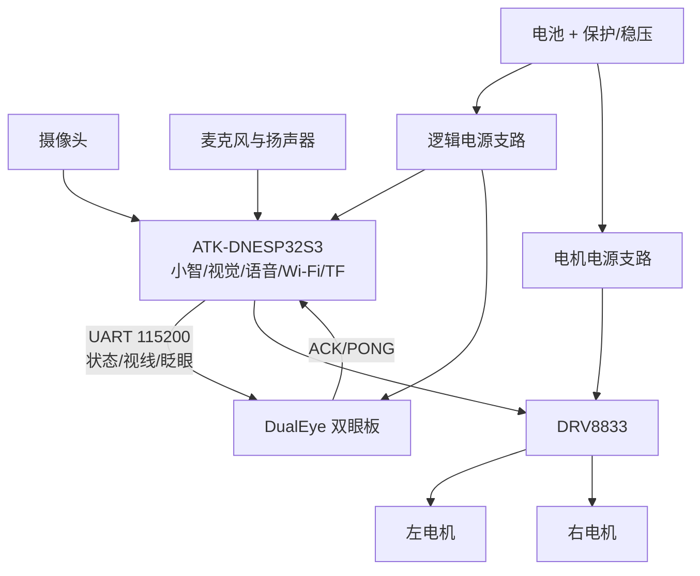

# ATK-DNESP32S3 + DualEye 双板桌宠方案

## 结论与职责划分

建议让 **ATK-DNESP32S3 做唯一主控**，负责摄像头、麦克风/扬声器、小智网络与语音、TF 卡和 DRV8833；DualEye 只负责双屏表情。两板之间用 3.3 V TTL UART，115200、8N1 通信。



这样做的原因是双眼动画不应被摄像头、Wi-Fi 或音频负载阻塞，而 ATK 可以把小智的状态变化转成很短的串口指令。

## UART 接线

先断电接线。ATK 的 P4 是 2×3 UART 选择座：顶排 1/2 属于 CH340，中排 3/4 直连 ESP32，底排 5/6 属于 GBC/RS232。默认两只竖向跳帽连接 1-3 和 2-4；**两只跳帽都要拔下**，然后从中排 3/4 取信号。若误接顶排 1/2，USB 串口仍可能正常，但小智应用的 UART 收不到 DualEye。

| ATK-DNESP32S3 | 方向 | DualEye LCD1 侧 SH1.0 14P | ESP32-S3 GPIO |
| --- | --- | --- | --- |
| P4-4：`U0_TXD` / GPIO43 | → | 9：`UART_RXD` | GPIO44 |
| P4-3：`U0_RXD` / GPIO44 | ← | 10：`UART_TXD` | GPIO43 |
| GND | — | 2 或 6：GND | GND |

注意：名称按信号方向交叉连接，即 TX 接对方 RX。不要从 P4 顶排 1/2 取线。DualEye 连接器从左到右按丝印编号 1–14；插线前应再对照板上丝印。官方资料：[DualEye Wiki](https://www.waveshare.com/wiki/ESP32-S3-DualEye-LCD-1.28) 和 [原理图 PDF](https://files.waveshare.com/wiki/ESP32-S3-DualEye-LCD-1.28/ESP32-S3-DualEye-LCD-1.28-Schematic.pdf)。

本方案的软件在两侧都使用 `UART_NUM_1`，但通过 ESP32-S3 GPIO Matrix 路由到物理 GPIO43/44。这样应用日志可以继续走 USB Serial/JTAG，不占协议外设。芯片复位早期仍可能在默认 UART0 TX 上输出 ROM 启动字符；DualEye 的行解析器会把不认识的行丢到错误响应，不会改变眼睛状态。

首次联调时，两块板各自用 USB 供电，只连接 TX、RX、GND，**不要连接两板的 3.3 V 或 5 V**。

用户照片里的板对板 USB-C 线不能替代上述三根线。当前两侧 USB 口都运行设备模式，且眼睛协议绑定在 UART1/GPIO43/44；没有 USB Host 就不会建立板间串口。若未来坚持只用一根 USB-C，需要新增 ATK 的 USB Host CDC 驱动、DualEye 的 USB CDC Device 协议以及供电角色处理，这属于另一套通信实现。

## UART 文本协议 V1

每条指令以换行 `\n` 结束；命令不区分大小写，最大 63 字节。

| ATK 发送 | DualEye 响应 | 效果 |
| --- | --- | --- |
| `PING` | `PONG 1` | 确认链路和协议版本 |
| `STATE IDLE` | `OK STATE IDLE` | 蓝色，自然扫视和眨眼 |
| `STATE LISTENING` | `OK STATE LISTENING` | 青绿色、虹膜放大并居中 |
| `STATE THINKING` | `OK STATE THINKING` | 紫色，快速左右思考 |
| `STATE SPEAKING` | `OK STATE SPEAKING` | 青色，轻微上下运动 |
| `STATE HAPPY` | `OK STATE HAPPY` | 金色、眯眼 |
| `STATE SAD` | `OK STATE SAD` | 灰蓝、眼睑下垂、视线向下 |
| `STATE ANGRY` | `OK STATE ANGRY` | 红色、眯眼、快速左右抖动 |
| `STATE SURPRISED` | `OK STATE SURPRISED` | 亮黄、虹膜放大、睁大眼 |
| `STATE SLEEPING` | `OK STATE SLEEPING` | 闭眼 |
| `GAZE -100 50` | `OK GAZE` | 视线左移并略向下，2 秒后恢复自动动作 |
| `BLINK` | `OK BLINK` | 立即同步眨眼 |
| `HELP` | `CMDS ...` | 返回命令摘要 |

非法状态、坐标、长行或队列已满分别返回 `ERR STATE`、`ERR GAZE`、`ERR OVERFLOW`、`ERR BUSY`。

## DualEye 端

已经实现于 [../firmware/dualeye-eye-test](../firmware/dualeye-eye-test)：

- `Eye_UART.cpp`：UART1、GPIO44 RX、GPIO43 TX、固定长度文本解析器；
- `LVGL_Example.cpp`：六种状态及线程安全命令队列；
- UART 任务只入队，所有 LVGL API 仍在 LVGL 定时器上下文执行。

上电后 DualEye 主动发送 `READY EYE_UART_V1`，随后默认进入 `IDLE`。

`IDLE` 自带随机扫视和眨眼，所以“眼睛会动”与“UART 已联动”是两件事。物理联动必须由 ATK 日志中的 `DualEye link established` 和 DualEye 的 `OK STATE ...` 回包确认。

## ATK 小智端

可复用模块在 [../firmware/atk-dnesp32s3-eye-uart](../firmware/atk-dnesp32s3-eye-uart)。复制两个源文件到小智的 `main` 后，在 `main/CMakeLists.txt` 的 `SOURCES` 中加入：

```cmake
"eye_uart_link.cc"
```

在 `application.cc` 中加入头文件，并只为当前板型启用：

```cpp
#ifdef CONFIG_BOARD_TYPE_ATK_DNESP32S3
#include "eye_uart_link.h"
#endif
```

在 `Application::Initialize()` 中，第一次设置状态之前初始化：

```cpp
#ifdef CONFIG_BOARD_TYPE_ATK_DNESP32S3
    if (EyeUartLink::Init() == ESP_OK) {
        EyeUartLink::SendState("THINKING");
        EyeUartLink::Ping();
    }
#endif
```

现有工程已经在 `Application::Initialize()` 注册了状态监听器。把发送调用加到该监听器中：

```cpp
state_machine_.AddStateChangeListener([this](DeviceState old_state,
                                               DeviceState new_state) {
    xEventGroupSetBits(event_group_, MAIN_EVENT_STATE_CHANGED);
#ifdef CONFIG_BOARD_TYPE_ATK_DNESP32S3
    EyeUartLink::SendState(GetEyeState(new_state));
#endif
});
```

`GetEyeState()` 是放在 `application.cc` 内的简单 `switch`，按下表返回协议字符串。不要把小智版本相关的 `DeviceState` 枚举耦合进 UART 驱动模块。

当前小智状态映射如下：

| 小智 `DeviceState` | 眼睛状态 |
| --- | --- |
| `Unknown`、`Idle` | `IDLE` |
| `Listening` | `LISTENING` |
| `Speaking` | `SPEAKING` |
| `Starting`、`WifiConfiguring`、`Connecting`、`Upgrading`、`Activating`、`AudioTesting` | `THINKING` |
| `FatalError` | `SLEEPING` |

`HAPPY`、`SAD`、`ANGRY`、`SURPRISED` 和真正的 `SLEEPING` 不是现有小智状态枚举的一部分，而是由语气情绪驱动（见下），或后续在唤醒成功/任务完成与电源管理事件中显式调用。

### 语气情绪映射（Speaking 期间生效）

服务器在 `llm` 消息里下发 `emotion` 字段（共 21 种），ATK 缓存后，在进入 `Speaking` 时用它覆盖默认的 `SPEAKING` 表情，从而让说话时的表情跟随语气。离开 `Speaking`（回到 `Idle`/`Listening`）时清空，恢复活动态。

| 服务器 `emotion` | 眼睛状态 |
| --- | --- |
| `neutral`、`relaxed`、`cool`、`confident`、`winking` | `SPEAKING` |
| `happy`、`laughing`、`funny`、`silly`、`delicious`、`loving`、`kissy` | `HAPPY` |
| `sad`、`crying` | `SAD` |
| `angry` | `ANGRY` |
| `surprised`、`shocked`、`embarrassed` | `SURPRISED` |
| `thinking`、`confused` | `THINKING` |
| `sleepy` | `SLEEPING` |

映射实现见 `application.cc` 的 `GetEyeStateFromEmotion()`；若服务器未下发 `emotion`，`Speaking` 回落到默认 `SPEAKING`。

### 物理按键

板载 KEY0~KEY3 由 XL9555 输入端口 1 读取（P1_7~P1_4，低电平有效）。已分配：

| 按键 | XL9555 端口 | 功能 |
| --- | --- | --- |
| BOOT（GPIO0） | — | 单击切换对话状态；开机时进入配网 |
| KEY1 | P1_6（bit6） | 音量减（步进 10） |
| KEY3 | P1_4（bit4） | 音量加（步进 10） |

音量按键在 `atk_dnesp32s3.cc` 的 `InitializeVolumeKeys()` 中通过轮询 XL9555 输入实现，带 20ms 采样 + 去抖。打断仍使用唤醒词或 BOOT 键。

ATK 的默认 ESP32-S3 控制台也是 UART0 GPIO43/44。必须把应用和 bootloader 主控制台切到原生 USB，才能让物理引脚只承载双眼协议：

```text
CONFIG_ESP_CONSOLE_USB_SERIAL_JTAG=y
CONFIG_ESP_CONSOLE_SECONDARY_NONE=y
```

实机日志应出现 `EyeUart: UART1 ready: TX GPIO43, RX GPIO44, 115200 8N1`，且不再出现 `GPIO 44 and 43 are used as console UART I/O pins`。COM12 仍通过 USB Serial/JTAG 输出调试日志。

当前模块在未收到回包时会自动发送 `PING`；收到 DualEye 的 `READY` 或 `PONG` 后会记录 `DualEye link established` 并重发当前状态。因此 ATK 与双眼的上电先后顺序不再影响首次状态同步。

## DRV8833 与引脚规划

当前 ATK-DNESP32S3 本地板级代码已占用摄像头、音频、I2C 和 SPI LCD 的大量 GPIO。若同时保留 ATK 自己的 LCD、摄像头、音频、TF 和 UART，留给 DRV8833 四路方向/PWM 输入的普通 GPIO 不足。

最小方案是最终机身不装 ATK 自己的 SPI LCD，只使用 DualEye 显示。这样可以把原 LCD 的 GPIO21（CS）和 GPIO40（DC）释放出来，与当前板级代码未使用的 GPIO2、GPIO8 组成四路电机控制候选：

| DRV8833 | ATK 候选 GPIO |
| --- | --- |
| AIN1 | GPIO2 |
| AIN2 | GPIO8 |
| BIN1 | GPIO21（停用 ATK LCD 后） |
| BIN2 | GPIO40（停用 ATK LCD 后） |

这四个只是根据当前源码占用情况得出的**候选**，还需要根据实际 ATK 底板原理图和排针连通性确认后再通电。GPIO11/12/13 应保留给 SPI/TF；GPIO19/20 应保留给 USB；GPIO43/44 已分配给双眼 UART。PWM 用 ESP-IDF MCPWM 或 LEDC 均可，先完成低速单轮测试，再接第二个电机。

如果必须保留 ATK LCD，建议加一块带硬件 PWM 的 I2C/PWM 控制器或专用电机 MCU；不要用板上的 XL9555 IO 扩展器直接做高频电机 PWM。

## 供电与抗干扰

- 电池必须经过保护板/BMS；逻辑电源和电机 VM 分成两个支路，但所有 GND 共地。
- 不要从 ATK 或 DualEye 的 GPIO、3.3 V 引脚给电机供电。
- 按电机额定电压选择 DRV8833 VM；电机堵转电流必须低于驱动和电池能承受的峰值。
- DRV8833 附近放置至少一只电解/低 ESR 大电容和 0.1 µF 去耦；每个有刷电机端子可就近加 0.1 µF 陶瓷电容。
- UART 线尽量短，远离电机线；若机身走线较长，可降低到 57600 或加串联 33–100 Ω 电阻。
- 首次测试顺序：独立 USB 供电 → 共地 → 只接 ATK TX 到 DualEye RX → `PING`/状态测试 → 再接回传 RX → 最后接 DRV8833 和电池。

## 分阶段验收

1. DualEye 独立上电：默认 `IDLE` 动画正常。
2. ATK 与 DualEye 独立 USB 供电、三线 UART：能收到 `PONG 1`，六个 `STATE` 都正确变化。
3. 小智状态联动：监听和播报分别稳定切换为 `LISTENING`、`SPEAKING`。
4. 电机支路断开，验证摄像头、语音、TF、Wi-Fi 同时工作不导致双眼复位。
5. 只接一个电机低占空比测试；检查电池压降和 UART 错包，再接第二个电机。
6. 最终上电时，确认自动握手后重发当前状态；断开并重启 DualEye 后也应再次收到 `READY` 并恢复当前状态。
