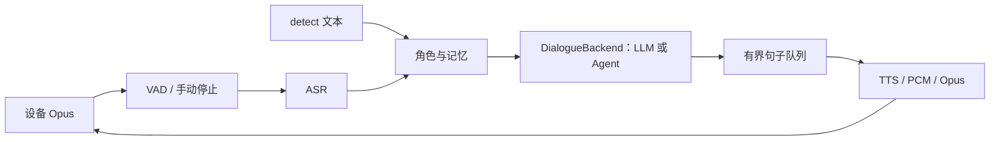

# 语音服务与 Agent 接口

本模块负责设备语音通信、识别、上下文、回复合成和打断。默认后端是 OpenAI 兼容 LLM；未来 Agent 的规划、工具调用和工具历史在 `DialogueBackend` 内处理，继续向语音层输出可朗读文本。

## 上游参考

本次参考 [xiaozhi-esp32-server](https://github.com/xinnan-tech/xiaozhi-esp32-server)。2026-09-22 已取得完整本地源码，现以 `/home/yyy/desktop/ai/xiaozhi-esp32-server` 为核对基准；语音功能与本地测试的剩余差别见 [功能对比](upstream-voice-comparison.md)。

| 上游实现 | 在本服务中的应用 |
| --- | --- |
| `core/handle/textHandler/listenMessageHandler.py` | `mode` 按消息状态处理；停止录音无需携带模式；`detect.text` 可直接发起对话 |
| `core/providers/llm/base.py`、`core/providers/intent/base.py` | 模型与业务决策放在可替换的后端边界内 |
| `core/connection.py`、`core/providers/tts/base.py` | 对话输出和 TTS 使用独立任务及句子队列衔接 |
| `core/utils/dialogue.py` | 系统角色提示与历史记忆分开构造 |

以上是参考设计后的本地实现，不是整个上游服务的替换或依赖，也没有复制它的管理后台、工具插件系统或多供应商实现。

## 数据流



输入音频固定 16 kHz、单声道、60 ms Opus；输出为 24 kHz、单声道、60 ms Opus。每连接拥有独立会话、codec 和 VAD；后端可以被多个会话共享。

## 后端契约

接口定义在 `src/voice_server/dialogue.py`：

```python
def stream(request: TurnRequest) -> AsyncIterator[str]: ...
```

`TurnRequest` 提供：

- `device_id`：跨连接的设备身份，可用于选择 Agent 的持久会话。
- `session_id`：当前 WebSocket 连接的会话身份。
- `turn_id`：当前轮次标识，用于日志、任务关联和取消。
- `text`：本轮识别结果或直接输入的文本。
- `messages`：系统角色、记忆摘要、近期上下文和当前用户消息；当前消息只追加一次。

后端逐块产出可朗读文本。工具参数、工具结果消息和框架内部事件由后端自己处理，最终选择需要说给用户的内容输出。当前契约不承诺通用工具调用协议。

当设备中断或断开时，语音层取消本轮任务并关闭文本迭代器。后端应传播 `asyncio.CancelledError`，在 `finally` 中清理本轮资源。如果 Agent 在远程独立运行，还需由适配器将取消传给其 API；取消本地迭代器不能自动撤回已完成的工具操作。

共享后端应将轮次状态放在局部变量或按设备/轮次隔离。应用停止时，如果注入对象实现了 `close()`，应用会调用它。LLM 配置仍用于本地记忆摘要，注入 Agent 不会禁用摘要服务。

## 最小接入示例

下面的后端可以直接用于验证接入，之后将 `stream` 方法内的回显替换为实际 Agent 调用：

```python
import asyncio
from pathlib import Path

from voice_server.app import ServerApplication
from voice_server.config import load_config
from voice_server.dialogue import TurnRequest
from voice_server.__main__ import run_application


class MyAgentBackend:
    async def stream(self, request: TurnRequest):
        yield f"收到你的请求：{request.text}。"


config = load_config(Path("config.yaml"))
app = ServerApplication.from_config(config, dialogue_backend=MyAgentBackend())
asyncio.run(run_application(app))
```

运行前仍需按 README 准备语音模型、Opus、FFmpeg 和配置。CLI 在 `mcp.enabled=false` 时使用 `LLMDialogueBackend`，开启后使用 `CameraMcpDialogueBackend` 连接本地测试页摄像头工具，并可通过独立视觉模型分析照片。自定义后端通过上述 Python 启动入口注入，优先于配置中的 MCP 后端，不需要修改 WebSocket、ASR 或 TTS 代码。

测试中的 `tests/session/test_dialogue_backend.py` 使用模拟 Agent 验证身份传递、上下文、语音输出、并行接收和取消，不需要实际 Agent 框架。

如果希望 Agent 自己处理点歌，将 `music.enabled` 设为 `false`；开启时，内置点歌分支会先处理匹配到的请求。

## 配置与上下文

```yaml
dialogue:
  system_prompt: 你是小桌，使用简洁、自然的中文口语回答。
  sentence_max_chars: 100
  sentence_queue_size: 2
memory:
  recent_limit: 10
  summary_threshold: 12
  context_limit: 64
```

系统提示始终保留；记忆摘要作为单独的参考消息追加。长文本到达 `sentence_max_chars` 后，即使没有句号也会分段；队列满时暂停接收更多文本，避免无限积压。队列等待不消耗 `llm.timeout_s` 的文本生成等待预算；注入 Agent 时同样使用该预算，可按任务耗时调整。

对话上下文包含最近消息和摘要尚未覆盖的消息，最多 `context_limit` 条。摘要一次只处理 `summary_threshold` 条，并在成功后推进进度。摘要长期失败、未摘要消息超过上限时，保留最新消息并记录警告；数据库中的原始记录不会删除。这里的上限按消息数计算，不是模型 token 预算。

管理 API 的 `limit` 仍只控制最近消息条数，与对话上下文的扩展窗口分开。

## 验证与后续改进

```bash
.venv/bin/python -m pytest -q
```

测试覆盖实际设备停止报文、本地 WebSocket 和 Opus 编解码、记忆持久化与设备隔离、Agent 接入和取消、点歌、转码进程回收。普通测试使用模拟模型，不验证识别准确率、云服务可用性和真机播放效果。

下一阶段可在这些边界上增加：

1. 实际 Agent 适配器：消费框架事件，输出文本，传递取消。
2. 流式 ASR 与流式 TTS：当前 ASR 等用户说完才识别，Edge TTS 仍收齐整段音频后转码；句子任务并行不代表音频端到端流式。
3. 真实语音延迟测量：分别记录静音判定、识别、首段文本和首包音频耗时。

当前 SenseVoice 的同步推理取消仍需等待模型线程退出，以保持共享模型的并发上限。需要更快打断时，应单独改造推理任务管理，不靠增加轮询解决。
